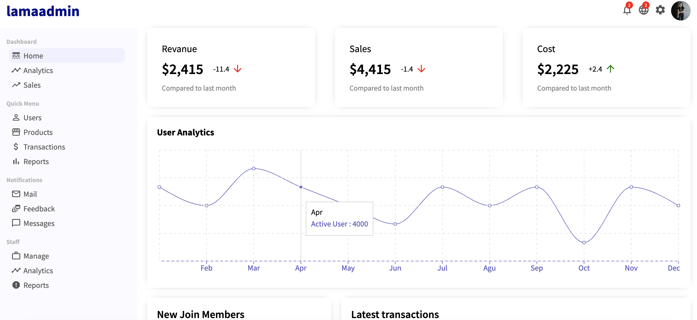
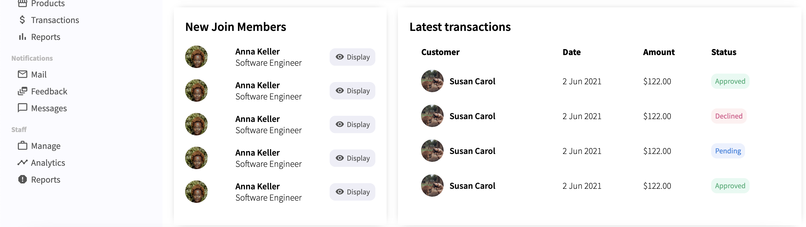

# Getting Started with Create React App

This project was bootstrapped with [Create React App](https://github.com/facebook/create-react-app).

## Available Scripts

In the project directory, you can run:

### `npm start`

Runs the app in the development mode.\
Open [http://localhost:3000](http://localhost:3000) to view it in the browser.

The page will reload if you make edits.\
You will also see any lint errors in the console.

# React Admin Dashboard Tutorial

## What you built? 

TODO: Short description of what you attempted to build

My pitch is a offer letter visualizer which will most likely have graphs and data tables inside. Therefore, I decided to create a project that is related to data visualization. In this project, I created a React admin panel dashboard using React Hooks and functional components. 

I used the [recharts library](https://recharts.org/en-US/) to create a graph with data.

## What you learned

I learnt that there are many useful librarys out there that can be imported to create clean designs and avoid reinventing the wheel. This is something that I really want to leverage for my final project so that I can spend more time on the functionality rather than the UI. 

## Authors

Nina Paripovic

## Acknowledgments

https://www.youtube.com/watch?v=aTPkos3LKi8

